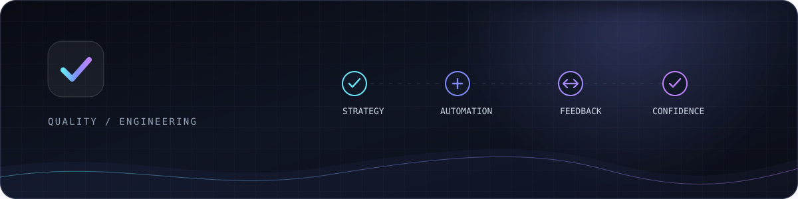
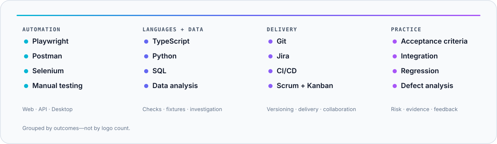
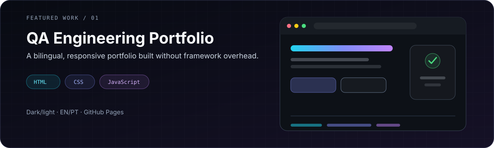
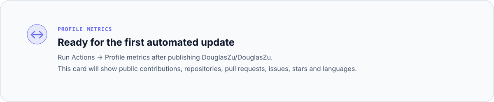

  

<h1 align="center">Douglas Zulim</h1>

<strong>Quality Assurance Engineer</strong> Reliable releases through thoughtful testing and automation.

  

  <a href="https://douglaszu.github.io">Portfolio</a>
  ·
  <a href="https://www.linkedin.com/in/douglaszulim/">LinkedIn</a>
  ·
  <a href="mailto:douglaszulim@gmail.com">Email</a>

## Quality, built into delivery

I'm **Douglas Zulim**, a Quality Assurance Engineer from Sorocaba, Brazil, with five years of experience in automated and manual testing for APIs and web/desktop interfaces. My background spans technical support and software quality at Eduzz, giving me a practical view of the whole feedback loop—from a user's problem to a reliable release.

I work across **web, API and desktop testing**, combining thoughtful manual testing with maintainable automation. I care about fast feedback, useful defect reports and quality signals that help teams make better release decisions.

| Focus | How I contribute |
| --- | --- |
| **Quality strategy** | Manual testing, acceptance criteria, integration and regression testing |
| **Automation** | Playwright, Postman and Selenium across UI and API layers |
| **Delivery** | CI/CD participation, Git versioning, Jira and actionable test reporting |
| **Investigation** | SQL-assisted analysis, defect triage and clear reproduction evidence |

## Quality engineering stack

  

<strong>Full capability map</strong>

 

| Area | Tools and practices |
| --- | --- |
| Test design | Manual testing, interface testing, integration, regression and acceptance-criteria validation |
| Automation | Playwright and Selenium across API, web and desktop flows |
| API quality | Postman, API validation, integration testing and defect investigation |
| Languages and data | TypeScript, Python and SQL |
| Delivery and collaboration | Git, Jira, CI/CD, Scrum and Kanban |
| Growing next | Cypress, GitHub Actions, k6, accessibility, OWASP Top 10, BDD/Gherkin and GraphQL testing |

## Featured work

### [QA Engineering Portfolio](https://github.com/DouglasZu/DouglasZu.github.io)

A bilingual, responsive portfolio that presents my quality mindset, toolset and professional journey. Built with semantic HTML, modular CSS and vanilla JavaScript, with no framework or build-time dependency.

`HTML` · `CSS` · `JavaScript` · `GitHub Pages` · [Live experience](https://douglaszu.github.io)

> Public automation case studies are the next priority. I prefer one repository with executable tests, reports and architecture evidence over several decorative cards with no code behind them.

## Experience

**Quality Analyst · Eduzz**  
Jun 2021 – Jun 2026

- Developed and maintained automated checks with Playwright and Postman for APIs and web/desktop interfaces.
- Implemented and executed integration and regression tests supporting release stability and quality.
- Collaborated with developers and product owners on requirements and acceptance criteria.
- Investigated defects and data inconsistencies with SQL, using Git for automation versioning and participating in CI/CD flows.

<strong>Earlier experience</strong>

 

**Mid-Level Support Analyst · Eduzz** · Jan 2021 – May 2021  
Investigated customer and platform issues with SQL, documented defects in Jira and collaborated in incident and problem analysis.

**Junior Support Analyst · Eduzz** · Sep 2019 – Dec 2020  
Supported customers through email and chat, including pixels, webhooks and platform-product configuration.

## Education & languages

**Technology degree in Systems Analysis and Development**  
Fatec Sorocaba · Completed in 2020

**English:** Intermediate

## Engineering signals

  

<strong>Contribution flow</strong>

 

<picture>
  <source media="(prefers-color-scheme: dark)" srcset="https://raw.githubusercontent.com/DouglasZu/DouglasZu/output/github-snake-dark.svg" />
  <source media="(prefers-color-scheme: light)" srcset="https://raw.githubusercontent.com/DouglasZu/DouglasZu/output/github-snake.svg" />
  
</picture>

## Quality roadmap

- [ ] Publish a Playwright + TypeScript E2E reference project with trace, report and CI artifacts
- [ ] Publish an API testing project with schema validation and negative-test strategy
- [ ] Add a k6 performance lab with thresholds, scenarios and result analysis
- [ ] Add accessibility and OWASP checks to the public quality pipeline
- [ ] Publish short technical notes after the supporting repositories are available

## Let's build confidence into the next release

I'm open to Quality Engineering and Test Automation opportunities where testing is part of product engineering—not a final gate.

  <a href="mailto:douglaszulim@gmail.com"><strong>Start a conversation</strong></a>
  ·
  <a href="https://www.linkedin.com/in/douglaszulim/">Connect on LinkedIn</a>

  

