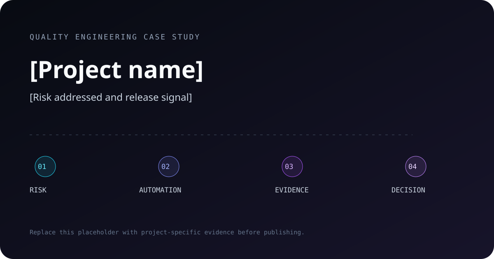
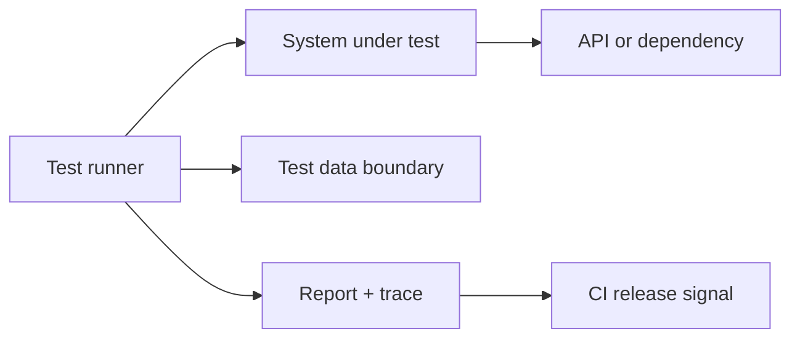

# [Project name]

> [One sentence: system or risk addressed, testing approach, and verifiable outcome.]

[](https://github.com/DouglasZu/REPOSITORY/actions/workflows/quality.yml)
[](./LICENSE)



## Why this project exists

Describe the user/business risk, the system boundary and why this testing level is appropriate. Avoid starting with the tool list.

## Quality strategy

| Risk | Test level | Evidence | Release signal |
| --- | --- | --- | --- |
| [Critical risk] | [E2E/API/component] | [Report/trace/log] | [Gate or observation] |

### Scope

- In scope: [critical paths and failure modes]
- Out of scope: [intentional boundaries and reason]
- Environments: [local/CI/staging assumptions]

## Architecture



Explain fixtures, clients/pages, data lifecycle, parallelism and reporting. Keep the diagram synchronized with the code.

## Quick start

```bash
git clone https://github.com/DouglasZu/REPOSITORY.git
cd REPOSITORY
npm ci
npm test
```

### Commands

| Command | Purpose |
| --- | --- |
| `npm test` | Run the default deterministic suite |
| `npm run test:smoke` | Run the release smoke signal |
| `npm run test:report` | Open or generate the local report |
| `npm run lint` | Validate code quality |

## CI evidence

Every pull request should publish the evidence needed to diagnose a failure:

- machine-readable result;
- human-readable HTML report;
- trace/log/screenshot only on failure;
- concise job summary;
- retention appropriate to repository sensitivity.

## Design decisions

### [Decision]

- Context: [constraint or risk]
- Choice: [what was done]
- Trade-off: [what becomes harder]
- Evidence: [how the choice is evaluated]

## Results

Report numbers only with baseline, method, environment and date.

| Signal | Baseline | Current | Method |
| --- | ---: | ---: | --- |
| [Example] | [value] | [value] | [repeatable measurement] |

## Challenges and learnings

- [Unexpected failure mode and investigation]
- [Flakiness or data-isolation lesson]
- [What remains manual and why]

## Roadmap

- [ ] [Next capability tied to a real risk]

## Contributing and security

See [`CONTRIBUTING.md`](./CONTRIBUTING.md). Report vulnerabilities privately according to [`SECURITY.md`](./SECURITY.md); never open a public issue with secrets or sensitive test data.

## License

[MIT](./LICENSE)
