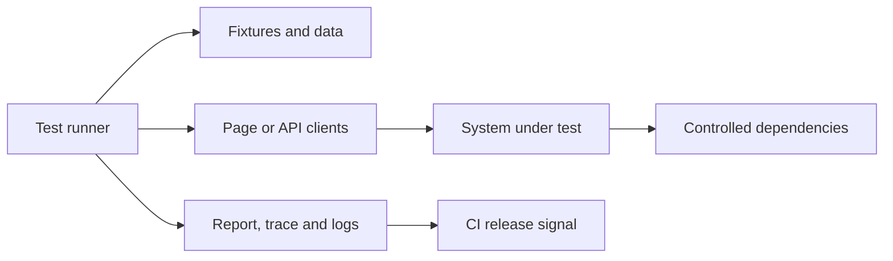

# Architecture

## Context

Document the system boundary, actors, dependencies and quality risks before describing folders or frameworks.

## Test architecture

## Decisions

For each important decision, record context, choice, alternatives, trade-offs and how the decision will be revisited.

## Data and secrets

Describe creation, isolation, cleanup, redaction and secret injection. Never use production customer data.
